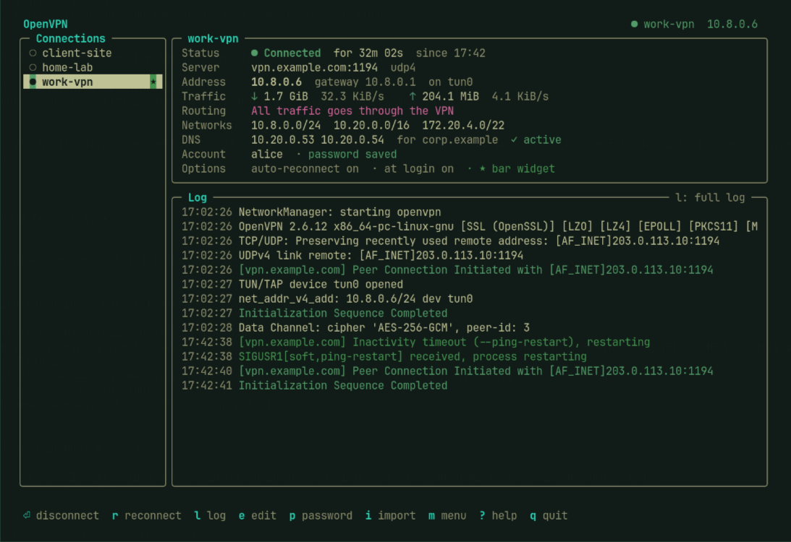
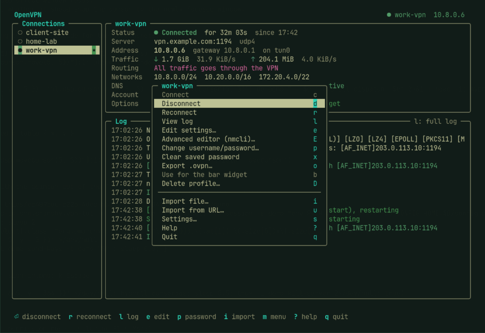
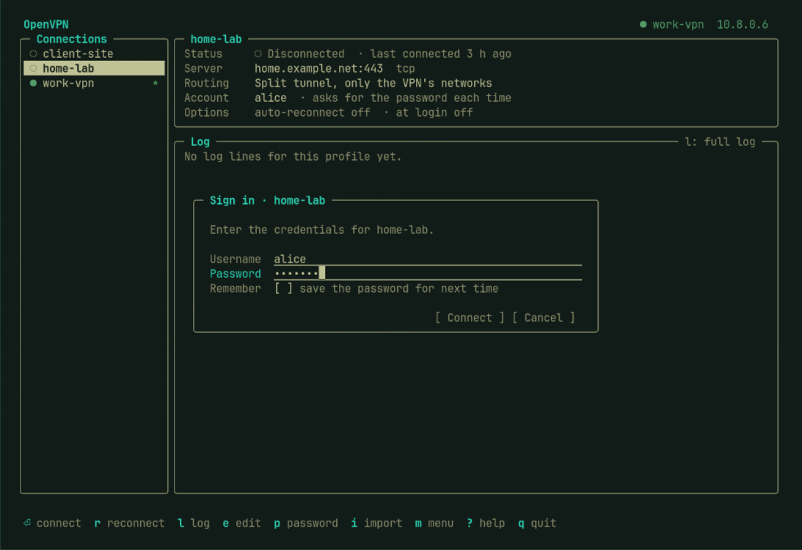
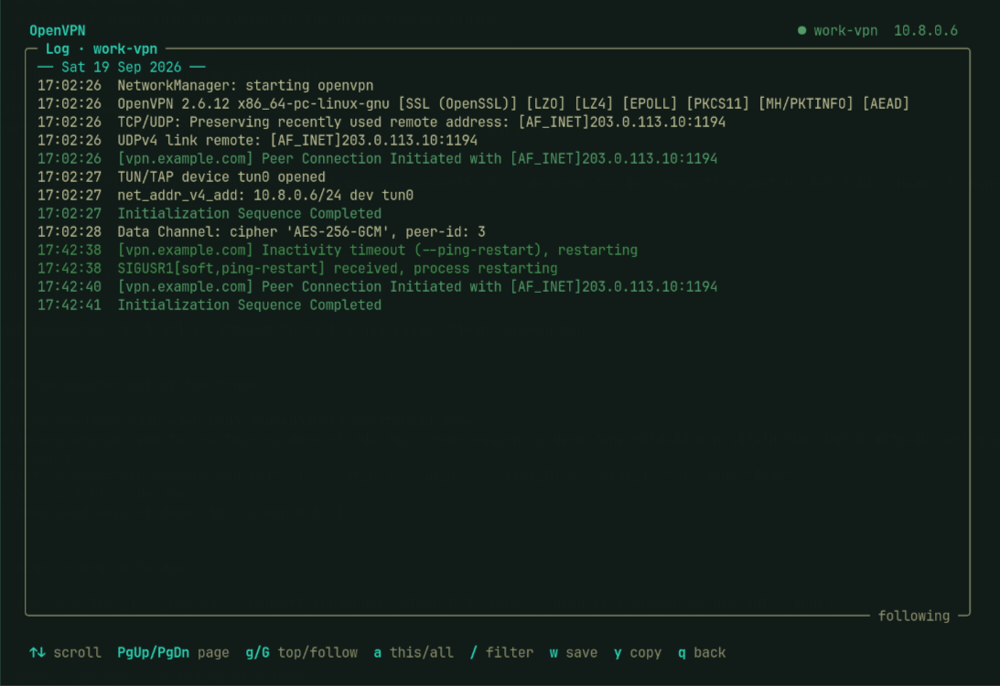

# vpn-tui

A terminal UI for OpenVPN on Linux: everything the OpenVPN GUI tray icon on
Windows gives you, on top of NetworkManager.



It works with the OpenVPN profiles NetworkManager already has, so it agrees
with your desktop's network menu and `nmcli`. It is a single Python file that
uses only the standard library.

## Features

| OpenVPN GUI (Windows tray) | vpn-tui |
|---|---|
| Connect / Disconnect / Reconnect | `Enter` toggles (and cancels while connecting), or `c` `d` `r` |
| Show Status | Always on screen, updated every second: uptime, server, VPN address, traffic and speed, full or split tunnel, pushed networks, DNS |
| View Log | `l`: OpenVPN, NetworkManager and D-Bus log for the profile, with dates. `/` filters, `w` saves, `y` copies |
| *(no equivalent)* | `h`: health check — probes the live tunnel instead of reading status fields |
| Username / password prompt | Opens by itself when a password is needed, with a **Remember** checkbox |
| Change Password / Clear Saved Passwords | `p` / `x` |
| Edit Config | `e`: name, server(s), full or split tunnel, auto-reconnect, connect at login, HTTP/SOCKS proxy. `E` opens `nmcli`'s editor for every other setting |
| Import file / Import from URL | `i` finds `.ovpn` files in Downloads, Documents and Desktop, with Tab path completion. `u` imports from a URL |
| Settings | `s`: desktop notifications, and which profile a status-bar widget controls |
| Tray balloon messages | Status line in the TUI, plus optional desktop notifications |

It also exports profiles as `.ovpn` (`o`) and deletes them (`D`).

## Health check

`h` probes a connected profile and reports what actually answers, rather than
what NetworkManager claims:

```
✓ Interface        tun0 holds 10.1.1.6
✓ Routes           5 pushed, all present
✓ DNS servers      2 of 4 answer for tiznit.local — 10.10.10.111, 10.10.10.112
✓ Resolves         tiznit.local: 10.10.10.111
```

The DNS servers are queried directly over UDP, around systemd-resolved, because
"this server answers" and "the resolver is using this server" are different
questions and only the second one is usually visible.

## Warnings

It warns about the failures that otherwise look like something else:

- a profile whose server is a private LAN address
- VPN DNS servers that systemd-resolved is not using, or a link it left with
  no DNS at all
- a public resolver answering for the VPN, when the profile pushes both public
  and private servers: every server reads as active, yet the VPN's own zone
  comes back NXDOMAIN
- **connected, but no interface holds the address** — after NetworkManager is
  restarted under a running openvpn, D-Bus refuses the helper's `SetIp4Config`,
  so the tunnel negotiates, logs `Initialization Sequence Completed` and
  carries nothing while `nmcli` still calls it activated. Reconnect to fix it.
- a tunnel that keeps restarting, as a count of reconnects in the last hour

The log view also carries the bus denial behind that last one: neither
NetworkManager nor OpenVPN reports it, so `l` includes `dbus-broker` /
`dbus-daemon` lines about the VPN plugin, which is the only place the cause
appears.

`m` or `Space` opens a menu with every action, and `?` lists the keys.

<table>
<tr>
<td></td>
<td></td>
</tr>
<tr>
<td align="center">Actions menu</td>
<td align="center">Sign-in prompt</td>
</tr>
<tr>
<td colspan="2"></td>
</tr>
<tr>
<td colspan="2" align="center">Log view</td>
</tr>
</table>

## Development

```sh
python3 -m unittest discover -s tests -v
```

No dependencies and nothing to install. The tests come in two groups: the
offline ones stand up their own DNS server on localhost or replace the
module's `run()` with canned output, so they pass anywhere including CI, while
the handful that need a live VPN skip themselves when there isn't one. Those
live tests are the only thing that checks the code still agrees with real
`nmcli`, `ip` and `resolvectl` output, so run them with a VPN up before
releasing.

`vpn-tui` has no `.py` extension, so the tests load it through
`SourceFileLoader` rather than importing it.

## Requirements

- Linux with **NetworkManager** and its **OpenVPN plugin**
  (`networkmanager-openvpn` or `networkmanager-vpn-plugin-openvpn` on Arch,
  `network-manager-openvpn` on Debian and Ubuntu, `NetworkManager-openvpn` on
  Fedora)
- **Python 3.8+** (standard library only)
- A UTF-8 terminal

Optional:

- Read access to the systemd journal, for the log. Members of the
  `systemd-journal`, `adm` or `wheel` group have it:
  `sudo usermod -aG systemd-journal $USER`, then log in again.
- systemd-resolved, for the DNS check
- `notify-send`, for desktop notifications
- `wl-copy`, `xclip` or `xsel`, to copy the log

## Install

```sh
git clone https://github.com/Amiral-Code/vpn-tui.git
cd vpn-tui
./install.sh            # installs to ~/.local/bin/vpn-tui
```

Or download just the script:

```sh
curl -fLo ~/.local/bin/vpn-tui https://raw.githubusercontent.com/Amiral-Code/vpn-tui/main/vpn-tui
chmod +x ~/.local/bin/vpn-tui
```

Make sure `~/.local/bin` is on your `PATH`, then run `vpn-tui`.

## Usage

```
vpn-tui                     open the TUI
vpn-tui --auth NAME         open it at the username/password prompt for NAME
vpn-tui --connect NAME      connect without a UI (used by "connect at login")
vpn-tui --disconnect NAME
```

`NAME` can be the profile name or its UUID.

| Key | Action |
|---|---|
| `↑` `↓` / `j` `k` | Select a profile |
| `Enter` | Connect or disconnect (cancels while connecting) |
| `c` `d` `r` | Connect, disconnect, reconnect |
| `l` | Full log |
| `e` | Edit settings |
| `E` | Advanced editor (`nmcli connection edit`) |
| `p` | Change username/password, then (re)connect |
| `x` | Clear the saved password |
| `i` / `u` | Import an `.ovpn` file / from a URL |
| `o` | Export as `.ovpn` |
| `b` | Make the status-bar widget control this profile |
| `D` | Delete the profile |
| `s` | Settings |
| `m` / `Space` | Menu with every action |
| `?` | Help |
| `q` / `Esc` | Quit |

## How it works

vpn-tui runs `nmcli` for every change and reads NetworkManager's state once a
second, so it stays in sync with whatever else changes your connections.

**Passwords.** With **Remember** ticked, NetworkManager stores the password in
the profile under `/etc/NetworkManager/system-connections/`, which only root can
read. With it unticked, the profile is set to ask every time. vpn-tui never
writes a password to disk itself and never puts one on a command line: it pipes
the password to `nmcli` on standard input.

**Logs.** NetworkManager tags its own journal lines with the profile's UUID.
OpenVPN logs as `nm-openvpn`, so vpn-tui links each OpenVPN process to the
profile that started it.

**Files it writes:**

| Path | What |
|---|---|
| `~/.config/vpn-tui/config.json` | Settings (notifications) |
| `~/.config/vpn-tui/bar-connection` | Name of the profile a bar widget controls |
| `~/.config/autostart/vpn-tui-<uuid>.desktop` | "Connect at login" for that profile (XDG autostart) |

## Omarchy bar widget (optional)

[`extras/omarchy/`](extras/omarchy) has scripts for an Omarchy bar button.
Left-click connects or disconnects. Right-click opens vpn-tui. Middle-click
shows the connection details. If a password is needed, the sign-in prompt
opens. The button controls the profile you pick with `b` in vpn-tui (by
default, the first VPN profile).

```sh
mkdir -p ~/.config/omarchy/bar/scripts
cp extras/omarchy/vpn-* ~/.config/omarchy/bar/scripts/
```

Add this module to `bar.layout.right` in `~/.config/omarchy/shell.json`, for
example next to `omarchy.network`. The bar reloads on save.

```json
{
  "id": "vpn",
  "type": "command",
  "exec": "~/.config/omarchy/bar/scripts/vpn-status",
  "interval": 3,
  "onClick": "~/.config/omarchy/bar/scripts/vpn-toggle",
  "onRightClick": "omarchy-launch-or-focus-tui vpn-tui",
  "onMiddleClick": "~/.config/omarchy/bar/scripts/vpn-details"
}
```

To make the window float like Omarchy's other bar TUIs, add this line to
`~/.config/hypr/hyprland.lua`:

```lua
o.window("org.omarchy.vpn-tui", { tag = "+floating-window" })
```

The scripts print Waybar-style JSON (`text`, `class`, `tooltip`), so they also
work in a Waybar `custom` module. There, launch the TUI with your terminal, for
example `alacritty -e vpn-tui`.

## Troubleshooting

**The log panel is empty.** Your user can't read the system journal. See
[Requirements](#requirements).

**DNS shows "⚠ not applied by systemd-resolved".** The VPN pushed DNS servers
but systemd-resolved isn't using them, so internal host names won't resolve.
One common cause is a global DNS override in NetworkManager, such as a
`[global-dns-domain-*]` section in `/etc/NetworkManager/conf.d/`. That
discards the DNS servers a VPN pushes. A NetworkManager dispatcher script can
put them back for the VPN's domain only, leaving your normal DNS alone. Save it
as `/etc/NetworkManager/dispatcher.d/90-vpn-split-dns`, owned by root and
executable:

```sh
#!/bin/sh
# Send lookups for the VPN's internal domain to the DNS servers the VPN pushes.
[ "$CONNECTION_ID" = "my-vpn" ] || exit 0      # your profile name
[ "$2" = "vpn-up" ] || exit 0
resolvectl dns "$VPN_IP_IFACE" $VPN_IP4_NAMESERVERS
resolvectl domain "$VPN_IP_IFACE" "~corp.example"   # your internal domain
```

**"Imported …, but its server … is a LAN address".** Some firewalls export
profiles that point at their inside address, which you can't reach from outside
the network. Press `e` and set the server to the public host name.

**Connecting says the password is required.** No password is saved for the
profile, or it's set to ask every time. vpn-tui opens the sign-in prompt. Tick
**Remember** to stop being asked.

## License

[MIT](LICENSE)
